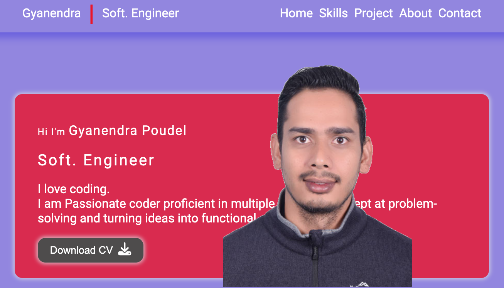

# Portfolio website

This portfolio showcases some of the projects I've worked on, demonstrating my skills and expertise in frontend development. Here, you'll find examples of my work, detailed case studies, and insights into my development process


## Table of of Contents
- [Introduction](#introduction)
- [Features](#features)
- [Technologies used](#technologies-used)
- [How to use](#how-to-use)
- [Usage](#usage)
- [Project Structure](#project-structure)
- [Contributing](#contributing)
- [License](#license)
- [Contact](#contact)
## Introduction
This is the portfolio website of Gyanendra, a software developer specializing in creating dynamic and responsive web applications. This website showcases my projects, skills, and professional background.
[Visit my live website](https://www.gyanendrapoudel.com)
## Features
- **Responsive Design**: Optimized for all devices, including desktops, tablets, and mobile phones.
- **Single Page App**: This website is build using single page app structure. The codebase for tech singlepage is not deployed but the code is available in `spa` branch
- **Skills and experience**: You got to projects to see my skills and experience

## Technologies used 
- **Frontend**
    -HTML5
    -CSS3
    -ReactJS
- **Deployment**
    -Vercel


## How to use 
 To set up this project on your device locally, Please follow the steps:
 1. **Clone the repository**:
  run the following command in your terminal: 
 >```
 >https://github.com/gyanendrapoudel/React-Portfolio.git
 >```
 2. **Navigate to the Project Directory**:
 >``` 
 >cd React-Portfolio
 >```
 3. **Instal Dependencies** 
 >```
 >yarn 
 >```
  4. **Run the development server** 
 >```
 >yarn dev
 >```
## Usage
Explore the website to see my projects, skills, and experience. You can contact me through the contact form provided on the site.
## Project Structure
```
|-- public
|-- src
| |--components
| | |--About.jsx
```
## Contributing

## License
This project is licensed under the MIT License. See the [LICENSE](https://docs.github.com/en/repositories/managing-your-repositorys-settings-and-features/customizing-your-repository/licensing-a-repository) file for details.
## Contact
Feel free to reach out to me at 

 - Email : gyanen56@gmail.com
 - LinkedIn:[https://www.linkedin.com/in/gyanendra-p-015a90182/]

---

Thank you for visiting my portfolio website repository! I hope you find it informative and engaging. Your feedback and contributions are highly appreciated.